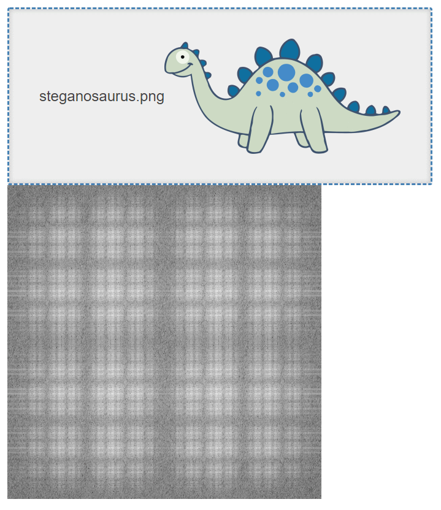

# ImageFFT
Based on code by [Andraz Krzisnik](https://www.linkedin.com/in/andraz-krzisnik-517146128/):

[How To Use Fourier Transform On Images](https://epochabuse.com/fourier-transform/)



# Features
* runs on .NET Core
* supports Linux
* runs in browser with webassembly

# Getting started

<details>

```bash
git clone https://github.com/TrevorDArcyEvans/ImageFFT.git
cd ImageFFT/
dotnet restore
dotnet build
dotnet test
```

 ## Web UI
```bash
cd cd ImageFFT.UI.Web/
dotnet restore
dotnet build
dotnet run
```

open [ImageFFT](http://localhost:5194/)

</details>

# Discussion
This library provides functions to perform a forward and inverse
[Fast Fourier Transform (FFT)](https://en.wikipedia.org/wiki/Fast_Fourier_transform)
on an image file.

The general restriction on FFT of an image is that the image must be square
and its dimensions must be a power of 2.  If the image does not meet these
restrictions, the library has functions to pad it out so that it does.

There is no specific restriction on colour depth as the image is automatically
converted to grayscale before doing a forward FFT.  This means that the inverse
FFT will return a grayscale version of the original image.

# Further work
* ~~port to [ImageSharp](https://github.com/SixLabors/ImageSharp)~~
* ~~unit tests~~
* ~~Blazor WASM web UI~~
* ~~automatically convert images to grayscale~~

# Further information
* [Articles by Andraz Krzisnik](https://epochabuse.com/author/andrson311/)
  * **lots** of **really** good articles (including code) on image processing 

# Acknowledgements
* [How To Use Fourier Transform On Images](https://epochabuse.com/fourier-transform/)
* [Fourier transform](https://github.com/Frederoche/Fourier-transform)
* [Grayscale](https://en.wikipedia.org/wiki/Grayscale) 
* [Arts fft scope icon](https://iconarchive.com/show/tulliana-2-icons-by-umut-pulat/arts-fft-scope-icon.html) 
 
